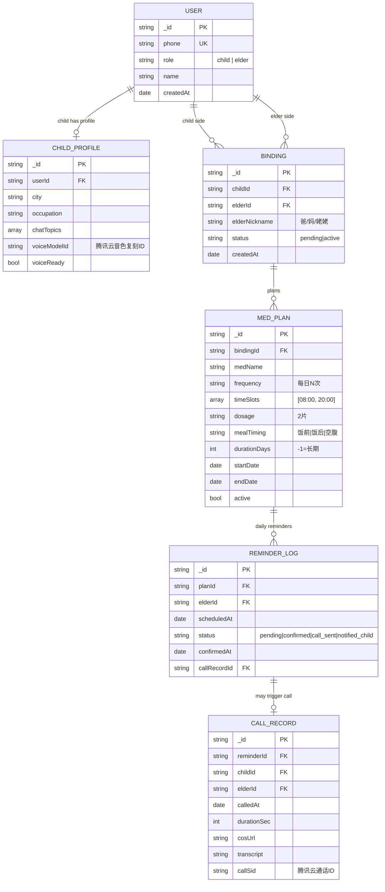

# 亲声药铃 (MediFamily) - 架构设计文档

版本：v1.0 MVP
日期：2026-03-07

---

## 一、技术栈

| 层 | 选型 | 说明 |
|----|------|------|
| 客户端 | Flutter (Android 先行) | 跨平台，后期复用到 iOS |
| 后端运行时 | Node.js 18 + 腾讯云 CloudBase | Serverless，按量计费 |
| 数据库 | CloudBase 云数据库（MongoDB） | 文档型，适合灵活的药品计划结构 |
| Push | 腾讯移动推送 TPNS | iOS/Android 全覆盖 |
| 电话外呼 | 腾讯云语音通知 VMS | PSTN，支持真实号码外呼 |
| 声音克隆 TTS | 腾讯云音色复刻 API | 与 VMS 同一生态 |
| AI 对话 | DeepSeek-V3 | 国内合规，流式输出，极低成本 |
| 语音识别 ASR | 腾讯云 ASR | 药品信息解析 + 通话确认语识别 |
| 对象存储 | 腾讯云 COS | 通话录音、声音采集文件 |

---

## 二、数据库 ER 图



---

## 三、三级提醒核心流程

```
CloudBase 定时触发器（每分钟）
  ↓
查询 MED_PLAN.timeSlots 命中当前分钟的计划
  ↓
创建 REMINDER_LOG { status: "pending" }
  ↓
调用 TPNS 发送 Push 给长辈
  ↓
30分钟后触发检查（CloudBase 延迟队列）
  ↓
REMINDER_LOG.status 还是 pending？
  ├─ confirmed → 结束
  └─ pending → 调用腾讯云 VMS 发起外呼
                  ↓
                通话接通 → WebSocket 接入 DeepSeek-V3 流式对话
                  ↓
                TTS 用子女音色克隆实时合成语音播放
                  ↓
                ASR 实时识别长辈语音
                  ↓
                通话结束（≤3分钟）→ 录音上传 COS → 更新 CALL_RECORD
                  ↓
                再等30分钟
                  ↓
                status 还是 pending？
                  ├─ confirmed → 结束
                  └─ pending → TPNS Push 通知子女
```

---

## 四、声音克隆流程

```
子女录入吃药计划（语音输入）
  ↓
首次录入：弹出声音授权确认弹窗
  ↓
录音文件上传 COS
  ↓
调用腾讯云音色复刻 API 提交训练
  ↓
训练完成回调 → 保存 voiceModelId 到 CHILD_PROFILE
  ↓
后续外呼时使用 voiceModelId 合成语音
```

---

## 五、项目目录结构

```
medifamily/
├── app/                          # Flutter Android 客户端
│   ├── lib/
│   │   ├── core/
│   │   │   ├── constants.dart    # 常量（API地址、超时时间等）
│   │   │   ├── theme.dart        # 全局主题（大字体适配）
│   │   │   └── utils/
│   │   ├── data/
│   │   │   ├── models/           # User, MedPlan, ReminderLog, CallRecord
│   │   │   ├── repositories/     # 数据仓库接口
│   │   │   └── services/         # CloudBase SDK 封装、TPNS
│   │   ├── domain/
│   │   │   └── usecases/         # 业务逻辑（创建计划、确认吃药等）
│   │   └── presentation/
│   │       ├── child/            # 子女端页面
│   │       │   ├── home/         # 首页（长辈列表、计划概览）
│   │       │   ├── plan/         # 吃药计划录入
│   │       │   ├── records/      # 打卡历史 + 通话记录
│   │       │   └── profile/      # 个人信息（声音采集入口）
│   │       ├── elder/            # 长辈端页面
│   │       │   ├── home/         # 首页（大字体今日用药）
│   │       │   └── confirm/      # 吃药确认
│   │       └── auth/             # 注册/登录
│   ├── android/
│   └── pubspec.yaml
│
├── backend/
│   ├── functions/
│   │   ├── auth/                 # 注册、登录、绑定邀请
│   │   │   └── index.js
│   │   ├── med-plan/             # 药品计划 CRUD
│   │   │   └── index.js
│   │   ├── reminder/             # 定时触发器 + 提醒调度
│   │   │   └── index.js
│   │   ├── call/                 # VMS 外呼 + DeepSeek 对话桥接
│   │   │   └── index.js
│   │   └── record/               # 打卡确认、记录查询
│   │       └── index.js
│   ├── shared/                   # 公共模块（db、cos、tpns 封装）
│   └── cloudbaserc.json
│
└── docs/
    ├── REQUIREMENTS.md
    └── DESIGN.md
```

---

## 六、关键 API 接口定义

### Auth
- `POST /auth/register` — 注册（手机号+密码+角色）
- `POST /auth/login` — 登录
- `POST /auth/binding/invite` — 子女发送绑定邀请
- `POST /auth/binding/confirm` — 长辈确认绑定
- `PUT /auth/child-profile` — 更新子女画像（城市/职业/话题）

### 药品计划
- `POST /med-plan` — 创建计划（含语音文件 URL）
- `GET /med-plan?elderId=` — 查询某长辈的计划列表
- `PUT /med-plan/:id` — 修改计划
- `DELETE /med-plan/:id` — 删除/停用计划

### 提醒与打卡
- `POST /record/confirm` — 长辈确认吃药（打卡）
- `GET /record/logs?elderId=&date=` — 查询打卡记录
- `GET /record/call/:id` — 获取通话记录详情（含录音 URL）

### 声音
- `POST /voice/upload` — 上传声音采集文件
- `GET /voice/status` — 查询音色复刻训练状态
